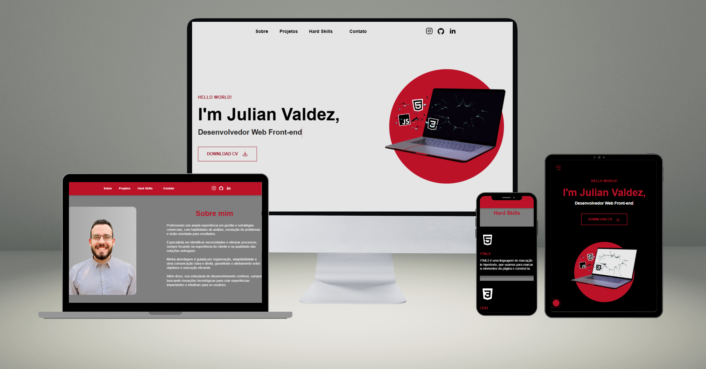

# Portfólio - Julian Valdez 👨🏼‍💻

Portfólio profissional desenvolvido com HTML5, CSS3 e JavaScript puro, focando em boas práticas de desenvolvimento, responsividade e experiência do usuário. O site apresenta uma interface moderna e interativa, com animações suaves e transições elegantes.



### 🌟 Características Principais

- **Design Responsivo**: Adaptação perfeita para todos os dispositivos (mobile, tablet e desktop)
- **Tema Claro/Escuro**: Sistema de alternância de temas com persistência de preferência
- **Animações Suaves**: Transições e revelações de elementos durante a navegação
- **Acessibilidade**: Estrutura semântica e navegação otimizada
- **Performance**: Otimizações de carregamento e execução

## 🛠️ Tecnologias & Ferramentas

- HTML5 Semântico
- CSS3 (Flexbox, Grid, Media Queries)
- JavaScript 
- ScrollReveal.js para animações
- EmailJS para formulário de contato

## 📱 Seções

1. **Home**
   - Apresentação inicial com animação de digitação
   - Visual interativo com notebooks e efeitos

2. **Sobre**
   - Informações profissionais
   - Imagem com efeito de zoom suave

3. **Projetos**
   - Grid de projetos com previews
   - Cards interativos com links para GitHub e demonstrações
   - Alternância entre projetos principais e desafios

4. **Hard Skills**
   - Apresentação de habilidades técnicas
   - Cards informativos com ícones

5. **Contato**
   - Formulário de contato integrado com EmailJS
   - Links para redes sociais
   - Informações de contato direto

## 💡 Diferenciais

### Sistema de Temas
- Alternância suave entre modo claro e escuro
- Persistência da preferência do usuário
- Adaptação completa de cores e contrastes

### Animações & Interações
- Menu de navegação responsivo
- Revelação suave de elementos no scroll
- Efeitos hover em cards e botões
- Transições fluidas entre estados

### Performance
- Lazy loading de imagens
- Debounce em eventos de scroll
- Código modularizado
- Otimização de recursos

### Responsividade
- Design mobile-first
- Breakpoints estratégicos
- Adaptação de layout e conteúdo
- Menu mobile otimizado

## 📦 Estrutura do Projeto

```
portfolio/
├── assets/
│   ├── img/
│   └── gifs/
├── js/
│   ├── main.js
│   ├── email.js
│   ├── projetos.js
│   └── desafios.js
├── css/
│   ├── style.css
│   └── responsive.css
└── index.html
```

## 🎨 Recursos Visuais

- Paleta de cores adaptativa para ambos os temas
- Tipografia consistente e legível
- Ícones vetoriais otimizados
- Imagens e GIFs demonstrativos

## 📱 Compatibilidade

- Chrome (última versão)
- Firefox (última versão)
- Safari (última versão)
- Edge (última versão)
- Responsivo para dispositivos móveis

## 📫 Contato

- Instagram: [Instagram](https://www.instagram.com/valdezjulian.dev/)
- LinkedIn: [Julian Valdez](https://linkedin.com/in/valdezjulian)
- GitHub: [@valdezjulian](https://github.com/valdezjulian)

## 📄 Licença

Este projeto está sob a licença MIT. Veja o arquivo [LICENSE](LICENSE) para mais detalhes.
